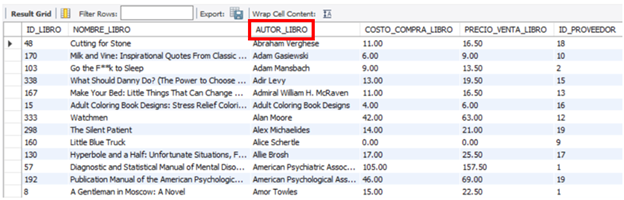

## Overview

This is the final project of a MySQL bootcamp completed at [Coderhouse](https://www.coderhouse.com/) academy. The objective of this project was to create a relational database based on a business model, develop objects that allow for maintenance of the database, and implement different SQL queries that generate useful information.

The original project was completed in Spanish. However, comments in English have been added to facilitate reading and understanding. Additionally, this readme file contains explanations that were part of the final project and can be useful for individuals who are new to MySQL.

Please feel free to reach out to me if you have any questions or comments. Thank you!

### Index

- [Introduction to the subject, Objective, Problem Situation and Business Model](#introduction-to-the-subject-objective-problem-situation-and-business-model)
- [Entity - Relationship Diagram](#entity-relationship-diagram)
- [List of tables](#list-of-tables)
  - [Table Cliente](#table-cliente)
  - [Table Tarjeta](#table-tarjeta)
  - [Table METODO_DE_PAGO](#table-metodo-de-pago)
  - [Table Pedido](#table-pedido)
  - [Table Descuento](#table-descuento)
  - [Bridge Table Descuento – Pedido](#bridge-table-descuento--pedido)
  - [Table Producto](#table-producto)
  - [Bridge table Pedido – Producto](#bridge-table-pedido--producto)
  - [Table Proveedor](#table-proveedor)
- [Data insert](#data-insert)
- [Views](#views)
  - [View # 1 – Top 5 Libros más vendidos](#view--1--top-5-libros-más-vendidos)
  - [View # 2 – Top 5 Autores más vendidos](#view--2--top-5-autores-más-vendidos)
  - [View # 3 – Facturación y Ganancia por Autor](#view--3--facturación-y-ganancia-por-autor)
  - [View # 4 – Descuento Menor Aplicado](#view--4--descuento-menor-aplicado)
  - [View # 5 – ocurrencias_descuentos](#view--5--ocurrencias_descuentos)
- [Functions](#functions)
  - [Function #1 – GANANCIA_PERIODO](#function-1--ganancia_periodo)
  - [Function #2 – CONTAR_TARJETAS](#function-2--contar_tarjetas)
- [Stored Procedures](#stored-procedures)
  - [Stored Procedure #1 – ordenamiento_producto](#stored-procedure-1--ordenamiento_producto)
  - [Stored Procedure #2 – nuevo_proveedor](#stored-procedure-2--nuevo_proveedor)
  - [Stored Procedure #3 – nuevo_pedido](#stored-procedure-3--nuevo_pedido)
- [Triggers](#triggers)
  - [Trigger #1 - log_insercion_proveedor](#trigger-1---log_insercion_proveedor)
  - [Trigger #2 – chequeo_vacios_proveedor](#trigger-2--chequeo_vacios_proveedor)
  - [Trigger #3 – trigger_insercion_producto](#trigger-3--trigger_insercion_producto)
  - [Trigger #4 – chequeo_producto_prohibido](#trigger-4--chequeo_producto_prohibido)
- [Implementation of sentences](#implementation-of-sentences)
  - [Users Creation](#users-creation)
  - [GRANT permits to users](#grant-permits-to-users)
  - [Check how the permits of the DB work](#check-how-the-permits-of-the-db-work)
- [Transaction Control Language](#transaction-control-language)
  - [DELETE from TARJETA table using TCL](#delete-from-tarjeta-table-using-tcl)
  - [INSERT records into DESCUENTO table using TCL](#insert-records-into-descuento-table-using-tcl)
- [Backup](#backup)

### Introduction to the subject, Objective, Problem Situation and Business Model
<!-- Use hyphens or underscores to separate words in the anchor link below -->

<!-- Content of the section goes here -->

The theme chosen to develop the database is to simulate an e-commerce company dedicated to the purchase of books from publishers/companies and their subsequent resale, through its website, to end consumers or other reseller companies. 

The list of products that this company is dedicated to commercialize (books) was taken from the database of the top 50 bestselling books by Amazon from 2009 to 2019: [Amazon Top 50 Bestselling Books 2009 - 2019](https://www.kaggle.com/datasets/sootersaalu/amazon-top-50-bestselling-books-2009-2019). 

This database has approximately 500 records where there is information about the book, author, user rating, number of reviews, price, year, genre, etc.

Based on this information, [examples](https://fabric.inc/blog/ecommerce-database-design-example/) of [e-commerce business](http://www.webassist.com/tutorials/Free-eCommerce-MySQL-Database) model [databases](https://github.com/runninguru/MySQL-eCommerce) were reviewed to get an idea of what the most important entities should be when designing a database of this type.

Based on these examples, it was concluded that, in order to correctly capture the business flow of an e-commerce firm, it was necessary to formulate entities such as: customers or users, orders, suppliers, payment methods, discounts, etc.

Some other entities, such as inventories or shipping methods, were conscientiously left aside to avoid over-complexizing the learning process of the course with issues that did not directly relate to the content of MySQL.

For the creation of these tables, in some cases, the Mockaroo page was used to create, for example, ID numbers, passwords, email addresses, supplier names, etc. In other cases, MS Excel was used directly, both to create random information and to generate coherent relationships between the records in the different tables (example: a CUSTOMER who places an ORDER and decides to use the CARD PAYMENT METHOD, must have a card registered in his name in the CARD table). Many other records were simply invented in a discretionary manner but always keeping a logical relationship with the rest of the information (example: quantity DISCOUNTS are applied only to those ORDERS that exceed 10 items).

Having defined the most important tables that shape the business model, the flow of information that the database is intended to capture is relatively intuitive and can even be seen in the Entity Relationship Diagram in the following section:

CUSTOMERS of our company register in our web page, from where pertinent information is captured such as: if they are companies or final consumers, what type of unique identification they have (CUIT or DNI), password to log in and operate in our interface and an e-mail as a means of contact.  

These CUSTOMERS place ORDERS that in turn contain PRODUCTS that, logically, are purchased by our firm from a list of SUPPLIERS. 

On top of this fundamental layer, other dimensions are added such as, for example: credit and debit cards that our CUSTOMERS have registered in our page, PAYMENT METHODS with which our CUSTOMERS will pay for the ORDERS and various DISCOUNTS that our company offers (sometimes based on internal variables such as, for example, quantity discounts or other times discounts on special dates such as Father's or Mother's Day, Book Day, etc.). 

This completed a database that correctly captures a simplified business model.

### Entity - Relationship Diagram

<!-- Use hyphens or underscores to separate words in the anchor link below -->

<!-- Content of the section goes here -->

### List of tables
<!-- Use hyphens or underscores to separate words in the anchor link below -->

#### Table Cliente
<!-- Use hyphens or underscores to separate words in the anchor link below -->

These are the customers / users who register on our company's website to buy books. They can be final consumers or reseller companies. It is an exclusive requirement to be registered on our website in order to place an order.

#### Table Tarjeta
<!-- Use hyphens or underscores to separate words in the anchor link below -->

The different credit and debit cards that our customers have registered when registering on our company's website. Managing this information can be used for sales campaigns, launching promotions, understanding the behavior of our customers, etc.

#### Table METODO_DE_PAGO
<!-- Use hyphens or underscores to separate words in the anchor link below -->

The different payment methods accepted by our company.

#### Table Pedido
<!-- Use hyphens or underscores to separate words in the anchor link below -->

All orders generated by customers through the website. Each order record has, in addition to the identification, a date and time, the customer placing the order and the payment method chosen to complete the transaction.

#### Table Descuento
<!-- Use hyphens or underscores to separate words in the anchor link below -->

List of the different discounts that the company offers to its customers with their respective names and descriptions.

#### Table Descuento – Pedido
<!-- Use hyphens or underscores to separate words in the anchor link below -->

Since the relationship between DISCOUNT and ORDER is many-to-many, a bridge table is generated where each line has a specific discount applied to a product.  An order can have more than one discount applied (example: a quantity discount and in addition a Book Day discount).

#### Table Producto
<!-- Use hyphens or underscores to separate words in the anchor link below -->

It is the list of the products that our company sells. In this case, books. The name of the book, the author, and the purchase price were taken directly from the Kaggle database (mentioned above). To calculate the selling price, a 50% markup was added. In addition, each of these products was assigned to a supplier.

#### Table Pedido - Producto
<!-- Use hyphens or underscores to separate words in the anchor link below -->

Since the relationship between ORDER and PRODUCT is many to many, a bridge table is generated where each line is a product (in a certain quantity) contained within an order. To better understand this table, you can look at the screen below where you can see that order 4 has 7 items from book 32 and also 6 items from book 98.

#### Table Proveedor
<!-- Use hyphens or underscores to separate words in the anchor link below -->

List of suppliers that sell products (books) to our company.

### Data Insert
<!-- Use hyphens or underscores to separate words in the anchor link below -->

<!-- Content of the section goes here -->
Records in this project were inserted into the database using the MySQL Workbench "Table Data Import Wizard". 
CSV flat files from which the records were imported are uploaded into this repository ([here](./csv_files/)). 
Given the relationship between primary and foreign keys, the order of import should be as follows:

### Views
<!-- Use hyphens or underscores to separate words in the anchor link below -->

#### View # 1 – Top 5 Libros más vendidos
<!-- Use hyphens or underscores to separate words in the anchor link below -->

<!-- Content of the section goes here -->
This view offers the 5 best-selling items (books), as well as their respective authors and number of items sold. 
It is composed of the tables PEDIDO_PRODUCTO and PRODUCTO.

The intuition of this view is to be able to have a query to understand which are the most popular books in sales and to make business decisions, advertising campaigns, etc.

This is what the view returns when called:

#### View # 2 – Top 5 Autores más vendidos
<!-- Use hyphens or underscores to separate words in the anchor link below -->

<!-- Content of the section goes here -->
This view offers the top 5 best-selling authors of books. It is interesting because an author can have more than one book for sale. Therefore, this view brings different information from the previous one. 

It is composed of the tables PEDIDO_PRODUCTO and PRODUCTO.

The intuition of this view is to be able to have a query to understand which are the most popular authors in sales and to make business decisions, advertising campaigns, etc.

This is what the view returns when called:

#### View # 3 – Facturación y Ganancia por Autor
<!-- Use hyphens or underscores to separate words in the anchor link below -->

<!-- Content of the section goes here -->
This view shows the revenue for each author, the cost of goods sold and the gross profit and its respective %. 

In addition, it is decided to show only those authors whose name contains the letter "J" in order to use the LIKE operator.

It is composed of the tables PEDIDO_PRODUCTO and PRODUCTO.

The intuition of this view is to be able to have a query to understand which authors are the most popular in sales and most profitable and make business decisions accordingly.

This returns the view when called with the loaded data:

#### View # 4 – Descuento Menor Aplicado
<!-- Use hyphens or underscores to separate words in the anchor link below -->

<!-- Content of the section goes here -->
This view brings a join between two tables to know which orders received the lowest possible discount currently offered by the company. 

The grace of this view is to be able to filter the information with a WHERE without knowing the ID or the name of the lowest discount of the company through a subquery.

It is composed of the tables DESCUENTO_PEDIDO, PEDIDO and makes the subquery to the DESCUENTO table.

This returns the view when called with the loaded data:

#### View # 5 – ocurrencias_descuentos
<!-- Use hyphens or underscores to separate words in the anchor link below -->

<!-- Content of the section goes here -->
This view counts the occurrences of discounts (DESCUENTO table) on orders (DESCUENTO_PEDIDO table). 

The intuition of this view is to be able to understand how much the DISCOUNTS offered by our company are being applied and based on this to evaluate their effectiveness.

This returns the view when called with the data loaded:

### Functions
<!-- Use hyphens or underscores to separate words in the anchor link below -->

#### Function # 1 – GANANCIA_PERIODO
<!-- Use hyphens or underscores to separate words in the anchor link below -->

The idea of this function is that it receives two input parameters (start date and end date) and returns the sales profit for that period. 
What it does is to calculate the sales and subtract the costs of that sold merchandise to show, precisely, the profit of the period that is passed as parameter. 
It is important to mention that the dates passed as parameter must be "valid".
To call the function, the start and end dates are passed as parameters as shown below:

Which returns: 

#### Function #2 – CONTAR_TARJETAS
<!-- Use hyphens or underscores to separate words in the anchor link below -->

The function count_cards receive an input parameter "param_card_type" that can be "credit" or "debit" and will return the number of cards that are registered in our database. 

What the function does is to count the number of rows of the CARD table with a count(*) filtering with a WHERE by the column "debit_credit" depending on whether "debit" or "credit" has been entered as parameter.

As shown below, there are 56 credit cards registered and 44 debit cards:

### Stored Procedures

#### Stored Procedure #1 – ordenamiento_producto

Sorts the "product" table by the column you want to use for sorting. It has two input parameters: 
- "field_to_sort" is the column by which you want to sort the "product" table.
- "order" is a boolean that accepts 0 for ascending order and 1 for descending order.

The stored procedure on the column "autor_libro" is called:

And this is what it returns respectively: 
Table "product" sorted in ascending order by column "author_book".

Table "product" sorted in descending order by column "author_book":

#### Stored Procedure #2 – nuevo_proveedor

Stored Procedure that inserts a new supplier in the PROVEEDOR table. It accepts 2 input parameters: 
- "param_supplier_name" which will be the name of the supplier to add.
- param_supplier_type" which will be the type of supplier (SRL, SA, SAS, etc).

An IF is added to make sure that the supplier’s name does not already exist in the PROVEEDOR table. In case it already exists, the SP does not add the record and warns by means of a message.

The SP is called as follows:

And we get that the first 3 records have been added while the last one is not added and a message is raised warning that there is already a supplier with that name in the table:

#### Stored Procedure # 3 – nuevo_pedido

Stored Procedure that inserts a new ORDER in the tables "PEDIDO", "PEDIDO_PRODUCTO" and "DESCUENTO_PEDIDO"
It does this through a TRANSACTION since 3 different tables are being impacted. It has 5 parameters: 

1.	"id_libro_param" product being ordered  
2.	"cant_prod_param" quantity of product being ordered 
3.	"fecha_pedido_param" date of the order 
4.	"id_cliente_param" client ID who is placing the order  
5.	"metodo_de_pago_param" payment method of the order 

In case the product, customer ID or payment method does not exist in the database, the SP will display a message indicating the problem. 

In addition, in case the ORDER date is a special date, the corresponding discount will be automatically applied (Ex: Discount for purchase on "Book Day").

In case the ORDER exceeds 10 items, discount # 1 (Quantity discount) will be applied automatically.

In this first part of the SP, we first check with an IF that the parameters entered (ID_LIBRO_PARAM, ID_CLIENTE_PARAM y METODO_DE_PAGO_PARAM) previously exist in the database.

If they do not exist, a warning message is raised and the insertion of records is suspended. If they do exist, the script continues:

Then, it checks if the FECHA_PEDIDO_PARAM matches the date of any of the discounts and stores that information in the variable @ID_DESCUENTO_FECHA. If no date discount is applied then @ID_DESCUENTO_FECHA is set to False:

The last check is to understand if the quantity discount applies: if CANT_PROD_PARAM is greater than 10 items, then the quantity discount applies and @ID_DESCUENTO_CANTIDAD is stored as "1" (quantity discount ID). If, on the other hand, CANT_PROD_PARAM is less than 10 items, then the quantity discount is not applied and @ID_DESCUENTO_CANTIDAD is stored as False.

Then we proceed to the INSERT of the PEDIDO/ORDER. A transaction is opened and the first INSERT is given in the PEDIDO table and the second in the PEDIDO_PRODUCTO table:

Finally, in case there are discounts, these records are inserted in the table DESCUENTO_PEDIDO, as follows:

We test the SP to verify that it works correctly.
We see that, prior to using the SP, the PEDIDO table only goes up to ID_PEDIDO = 500:

We proceed to call the SP passing it as parameters:
•	id_libro_param = 1
•	cant_prod_param = 11 
•	fecha_pedido_param = '2022-10-16'
•	id_cliente_param = 1
•	metodo_de_pago = 1

We check the tables to see if the procedure ran correctly. 
We see that the record appears in the PEDIDO table with ID_PEDIDO = 511 with the parameters we passed above:

The same happens in the PEDIDO_PRODUCTO table where the 11 items of the ID_LIBRO = 1 are reflected:

Finally, it is noted that, since the quantity discount (ID_DTO = 1) and the Mother's Day discount (ID_DTO = 5) apply to this order, both discounts are recorded in the DESCUENTO_PEDIDO table:

